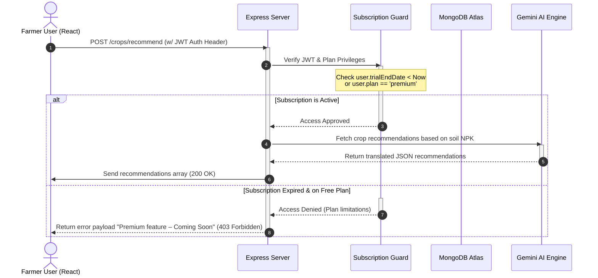

# KrishiMitra AI - System Architecture Documentation

This document describes the structural design, data schema models, and transaction flow sequences of the KrishiMitra AI platform.

---

## 🏗️ System Architecture Model
KrishiMitra AI employs a decoupled three-tier MVC model:
1. **Frontend Layer (Client)**: Built with React, Vite, and TypeScript. Uses Axios clients with interceptors to handle token authentication. Routing uses lazy loaded route splitting.
2. **Backend Controller Layer (Express)**: Built with Node and TypeScript. Manages routes, input validations, security boundaries, rate limiters, and subscription checks.
3. **Database & Core Service Layer**: MongoDB Atlas cluster storing user profiles, farms, diseases cache, and weather history. Decoupled services wrap Gemini, OpenWeather, PDFKit, and Billing.

---

## 🗄️ Database Entity Relationship Diagram (ERD)

### 1. User Entity Schema
Stores user accounts, system roles, preferences, subscription tiers, and limit metrics.

| Field Name | Type | Description |
| :--- | :--- | :--- |
| `_id` | ObjectId | Primary Key |
| `name` | String | User's full name |
| `email` | String | Unique email address (indexed) |
| `password` | String | Bcrypt hash |
| `phone` | String | Mobile number (indexed) |
| `role` | String | `farmer`, `expert`, or `admin` |
| `plan` | String | `free`, `premium`, or `enterprise` |
| `subscriptionStatus` | String | `active`, `inactive`, `expired`, or `trialing` |
| `subscriptionType` | String | `monthly`, `yearly`, `trial`, or `none` |
| `trialStartDate` | Date | Timestamp when trial started |
| `trialEndDate` | Date | Timestamp when 90-day trial expires |
| `subscriptionExpiry` | Date | Expiry date of trial or purchased plan |
| `scansUsedToday` | Number | Scan count (resets daily) |
| `chatMessagesToday` | Number | Chatbot count (resets daily) |
| `lastLimitResetDate` | Date | Day tracking marker |

### 2. Crop/Farm Profile Schema
Stores boundary coordinates and soil conditions.

| Field Name | Type | Description |
| :--- | :--- | :--- |
| `_id` | ObjectId | Primary Key |
| `user` | ObjectId | Foreign Key (references `User._id`) |
| `name` | String | Farm name |
| `size` | Number | Farm size in acres |
| `soilType` | String | Soil type (e.g. Loamy, Clayey) |
| `waterSource` | String | Water source (e.g. Canal, Tube Well) |
| `boundary` | Array | GPS latitude/longitude coordinate array |

---

## 🔄 API Request Sequence Flow Diagram

